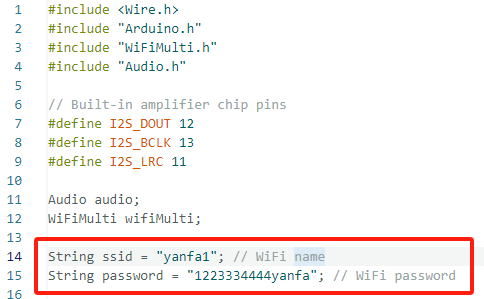

# **Play Internet music example**

This is an example of a program that uses a speaker to play an MP3 file from the Internet.

 

***\*Note: All examples run on ESP32 version 3.0.2.\****

 

### **How to use example**

After opening the sample code in the relevant code file with Arduino IDE.

Set up your wifi in code.

set the required configuration parameters and program it onto the development board

***\*Configuration parameter：\****

After burning the program successfully, insert the speaker into the designated port on the development board.

**Note**:Before burning the code, be sure to set the switch on the back of the product to MIC&SPK mode(0 0).

### **How to add Arduino libraries**

Replace the libraries file with the following path:

C:\Users\user name\Documents\Arduio\libraries

 

***\*Note\****: The 'user name' here is the same as the user computer account name.

 

## **Documentation tutorial link**：

https://www.elecrow.com/pub/wiki/4.3_2_Introduce_the_screen_user_interface_and_external_speakers_for_playing_songs.html

 

## **Video** **tutorial link**：

https://www.youtube.com/watch?v=1lY-Cu6dnaQ&list=PLwh4PlcPx2Gfrtm7TmlARyF4ccTmIy-gK&index=2

 

