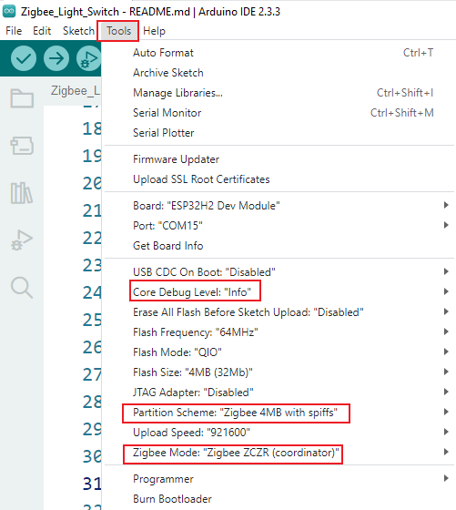
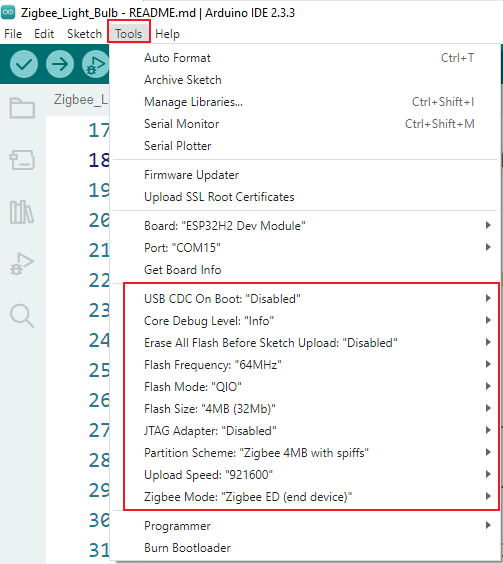

# **The ESP32-H2 module utilizes ZigBee technology to build a wireless Internet of Things** **example**

To complete this case, you need to refer to the detailed documentation tutorial, learn to burn code to utilizes ZigBee technology to build a wireless Internet and make the coordinator sends information to the terminal. Detailed documentation tutorials can be found at the bottom of the page.

***\*Note: All examples run on ESP32 version 3.0.2.\****

 

### **How to use example**

 

Learn how to set up the development board for serial communication with the wireless module. Learn how to use the official sample programs of ESP32-H2 to configure the wireless modules as a coordinator and a terminal node. After opening the sample code in the relevant code file with Arduino IDE.set the required configuration parameters and program it onto the development board.

***\*Configuration parameter：\****

For Coordinator configuration

For Terminal device configuration

For HMI Advance AI Display Configuration

### **How to add Arduino libraries**

Replace the libraries file with the following path:

C:\Users\user name\Documents\Arduio\libraries

 

***\*Note\****: The 'user name' here is the same as the user computer account name.

 

## **Documentation tutorial link****：**

## https://www.elecrow.com/wiki/9.ZigBee.html

## **Video** **tutorial link****：**
https://www.youtube.com/watch?v=UfxxT23T_bk
 
